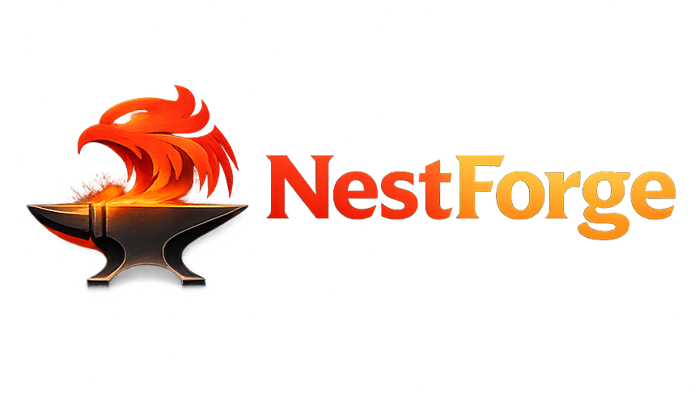

  

NestForge is a VS Code extension for driving the `nestforge` CLI from the editor. It provides guided scaffolding, generator workflows, database operations, Rust utility commands, onboarding, and workspace-aware context menus for NestForge projects.

## Current Release

- Latest version: `0.3.0` <!-- x-release-please-version -->
- Release notes: see [CHANGELOG.md](./CHANGELOG.md) and [GitHub Releases](https://github.com/vernonthedev/nestforge-extension/releases)
- License: [Apache-2.0](./LICENSE)
- Quick Start Guide: [Start Here](./docs/quickstart.md)
- Contributing guide: [CONTRIBUTING.md](./CONTRIBUTING.md)

## Features

### Scaffolding Wizard

Run `NestForge: New Application` from the Command Palette to scaffold a new app with a guided flow:

1. Enter the application name.
2. Pick one or more transports.
3. The extension runs `nestforge new <app-name>` with repeated `--transport <value>` options.

Available transport values:

- `http`
- `graphql`
- `grpc`
- `microservices`
- `websockets`

### Generator Wizard

Run `NestForge: Generate` to open a nested QuickPick workflow:

1. Choose a category: `Core`, `Cross-Cutting`, or `Transport`.
2. Choose a generator such as `Resource`, `Interceptor`, `Service`, or `Gateway`.
3. Enter the resource name.
4. If required, select the target module.

The extension then runs the matching `nestforge g ...` command and refreshes the File Explorer so generated files appear immediately.

### Explorer Context Menus

Right-click a folder in the Explorer to access:

- `NestForge: Generate`

`Generate` opens the normal generator selection flow and also works from the selected folder in the Explorer. If the folder is a real Nest module such as `src/users`, module-aware generators will target `users` automatically. Non-module generators such as guards and pipes run relative to the selected folder.
`DTO` is not listed as a standalone command because the local `nestforge` CLI does not expose a `dto` generator. DTO-related files come from `resource` generation rather than a direct `nestforge g dto` command.

### Database Dashboard

The extension contributes a dedicated `NestForge DB` command group:

- `NestForge DB: Init`
- `NestForge DB: Generate`
- `NestForge DB: Migrate`
- `NestForge DB: Status`

Database status is also surfaced in the status bar. The extension can poll `nestforge db status` on an interval and after saves to detect pending migrations or database changes that need review. If a warning-like status is detected, the status bar switches to a warning state.

`NestForge DB: Migrate` checks for a `.env` file in the workspace root before running.
`NestForge DB: Generate` prompts for a migration name before running `nestforge db generate <name>`.

### Utilities

- `NestForge: OpenAPI Docs` opens the configured docs URL.
- `NestForge: Format Rust` runs `cargo fmt`.
- `NestForge: Open Logs` reveals the `NestForge Logs` output channel.

### Logging and Progress

- Long-running operations such as DB migrations and project formatting run with `vscode.window.withProgress`.
- CLI stdout and stderr are streamed to the `NestForge Logs` output channel.
- stderr is shown automatically on command failures so CLI errors stay visible.

### Walkthrough

The extension includes a getting-started walkthrough that links directly to:

- project scaffolding
- generator workflows
- database status checks
- extension docs

## Requirements

- VS Code `1.109.0` or later
- A `nestforge` CLI executable available on your `PATH`, or a custom path configured through settings
- `cargo` installed if you want to use `NestForge: Format Rust`

## Commands

### NestForge

- `NestForge: New Application`
- `NestForge: Generate`
- `NestForge: OpenAPI Docs`
- `NestForge: Format Rust`
- `NestForge: Open Logs`
- `NestForge: Open Extension Docs`

### NestForge DB

- `NestForge DB: Init`
- `NestForge DB: Generate`
- `NestForge DB: Migrate`
- `NestForge DB: Status`

## Extension Settings

This extension contributes the following settings:

- `nestforge.cliPath`: executable used for NestForge CLI commands. Default: `nestforge`
- `nestforge.cargoPath`: executable used for cargo commands. Default: `cargo`
- `nestforge.docsUrl`: URL opened by `NestForge: OpenAPI Docs`. Default: `http://localhost:3000/api/docs`
- `nestforge.dbStatus.enabled`: enable or disable DB status polling and the status bar item. Default: `true`
- `nestforge.dbStatus.intervalMs`: polling interval for `nestforge db status`. Default: `300000`

## Usage Notes

- The extension activates on `onStartupFinished`.
- Most commands require an open workspace folder.
- Module-aware generators attempt to discover modules from `src/` first and then fall back to the workspace root.
- If a command generates or changes files, the extension refreshes the File Explorer after the CLI completes.

## Known Issues

- Database status currently relies on parsing `nestforge db status` output for keywords and counters such as `Drift`, `Pending`, `out of sync`, and `up to date`. If the CLI output format changes, the status bar mapping may need to be updated.
- The extension assumes `nestforge` and `cargo` can be executed in the workspace shell environment configured by VS Code.

## Release Workflow

- Merge conventional commits into `main` using prefixes such as `feat:`, `fix:`, and `feat!:` for breaking changes.
- GitHub Actions opens or updates a release PR through `release-please` only after the `Test and Lint` workflow in [.github/workflows/test.yml](/c:/Users/editing/Desktop/coding/extensions/nestforge/.github/workflows/test.yml#L1) passes for `main`.
- Merging that release PR updates `package.json`, `CHANGELOG.md`, and the version marker in this README before creating the GitHub release.
- The workflow uses the repository `GITHUB_TOKEN`, so GitHub repository settings must allow Actions to create pull requests.
